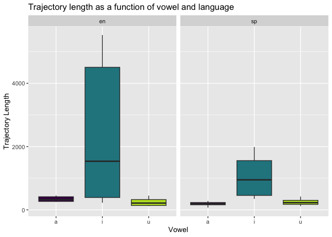
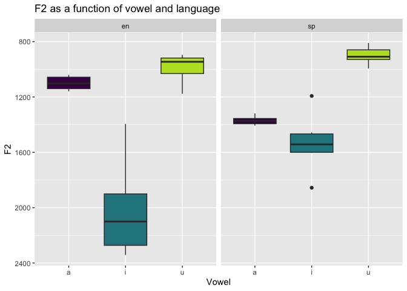

# Programming Assignment 3
2024-04-01

# The script

**Question 1. Examine the portion of the script you see below. In your
own words what does this section do and why does it work? Demonstrate
that you understand the code…**

``` r
vonset = Get starting point: 2, 2
voffset = Get end point: 2, 2
durationV = voffset - vonset
per20 = vonset + (durationV * 0.20)
per35 = vonset + (durationV * 0.35)
per50 = vonset + (durationV * 0.50)
per65 = vonset + (durationV * 0.65)
per80 = vonset + (durationV * 0.80)
```

I think that this portion of the script sets five different temporal
points, that correspond to the 20-35-50-65-80%-points of the vowel and
that will be used to extract F1 and F2 frequencies of the target vowels
at these different time points. I am not completely sure what the first
two lines of code mean, but they might be telling Praat to focus on tier
2 (vowel), as for both the vocal onset (vonset) and the vocal off set
(voffset).

This procedure is similar to the one that we saw in Jacewicz et
al. (2011)!

<br>

**Question 2. In a few short sentences describe the general outline of
the script, what the purpose is, and how it achieves this purpose?**

By using this script our aim is to extract the F1 and F2 measurements of
the target vowels at different temporal locations, as well as calculate
spectral centroids and trajectory length, and save all these results to
a csv file in order to do the analysis using R studio. The script
achieves this purpose because the following elements are specified:

1.  Create path and prepare the file to store the output (csv file with
    all the measurements, participant ID, etc.).

2.  Set the path to the .wav and .TextGrid files in order to tell Praat
    where to get the input from.

3.  Prepare and run the loop by setting up the defaults and adding the
    necessary instructions in order for Praat to automatically extract
    F1 and F2 measurements at different temporal points, and calculate
    the spectral centroids and trajectory length for each target vowel,
    in each language. In addition, add the instruction to print results
    and save them in a csv file, in the location that was specified in
    1.

<br>

**Question 3. In a few short sentences describe how the segmenting
procedure you used this week differs from that used in pa_2. What are
the advantages and disadvantages?**

Both of the scripts used in pa_2 and pa_3 have the aim of extracting
different vowel acoustic measurements. In pa_2, we used two different
scripts: one to segment the .wav file and one to calculate and extract
f0, duration, and intensity at midpoint. For pa_3, we are using only one
script which extracts F1 and F2 measurements of the target vowels at
different temporal locations, F1 and F2 spectral centroids, and vowel
tragectory length. Thus, the main differences concern the type of data
they produce:

1.  Whereas in pa_2 we calculated all the values at the midpoint of the
    vowel, in pa_3 we are calculating them at different locations within
    the target vowel. This ‘new’ approach is the same that Jacewicz et
    al. (2011) used in the paper that we read for March 25.

2.  In addition, in pa_2 we focused on f0, intensity and duration, but
    in pa_3 on different F1 and F2 measurements, spectral centroids
    (overall vowel position in the acoustic space), and trajectory
    length (a measure of formant movement that indicates the amount of
    formant change over the course of a vowel’s production).

The advantages of using the script for pa_3 is that we can do a more
detailed analysis on the acoustic properties of the vowels, as it
captures the dynamic nature of formant trajectories. As for
disadvantages I am not sure, but I suppose that it is more complex to
write (and easier to make a mistake) and perhaps it has a higher
“computational cost”.

<br>

# The data

``` r
library("tidyverse")
library("here")
```

``` r
data <- read_csv(here("data", "vowel_data.csv"))
```

    Rows: 36 Columns: 17
    ── Column specification ────────────────────────────────────────────────────────
    Delimiter: ","
    chr  (4): id, item, vowel, language
    dbl (13): f1_cent, f2_cent, tl, f1_20, f1_35, f1_50, f1_65, f1_80, f2_20, f2...

    ℹ Use `spec()` to retrieve the full column specification for this data.
    ℹ Specify the column types or set `show_col_types = FALSE` to quiet this message.

``` r
summary(data)
```

          id                item              vowel             language        
     Length:36          Length:36          Length:36          Length:36         
     Class :character   Class :character   Class :character   Class :character  
     Mode  :character   Mode  :character   Mode  :character   Mode  :character  
                                                                                
                                                                                
                                                                                
        f1_cent         f2_cent             tl              f1_20      
     Min.   :304.9   Min.   : 810.0   Min.   :  69.88   Min.   :336.5  
     1st Qu.:401.7   1st Qu.: 987.9   1st Qu.: 210.01   1st Qu.:381.4  
     Median :432.2   Median :1185.0   Median : 301.14   Median :414.8  
     Mean   :507.2   Mean   :1317.9   Mean   : 741.88   Mean   :491.6  
     3rd Qu.:658.2   3rd Qu.:1467.0   3rd Qu.: 449.51   3rd Qu.:603.4  
     Max.   :782.1   Max.   :2341.6   Max.   :5525.01   Max.   :763.7  
         f1_35           f1_50           f1_65           f1_80      
     Min.   :307.9   Min.   :300.3   Min.   :276.9   Min.   :287.7  
     1st Qu.:383.5   1st Qu.:394.9   1st Qu.:402.2   1st Qu.:422.0  
     Median :415.5   Median :428.3   Median :442.0   Median :463.6  
     Mean   :497.8   Mean   :509.1   Mean   :514.6   Mean   :522.9  
     3rd Qu.:650.0   3rd Qu.:663.4   3rd Qu.:693.6   3rd Qu.:691.3  
     Max.   :772.5   Max.   :795.8   Max.   :818.0   Max.   :793.7  
         f2_20            f2_35            f2_50            f2_65       
     Min.   : 738.1   Min.   : 727.8   Min.   : 802.5   Min.   : 674.6  
     1st Qu.: 922.7   1st Qu.: 916.8   1st Qu.: 969.3   1st Qu.: 948.2  
     Median :1110.8   Median :1087.5   Median :1127.1   Median :1122.4  
     Mean   :1308.5   Mean   :1266.4   Mean   :1340.8   Mean   :1254.5  
     3rd Qu.:1555.1   3rd Qu.:1460.9   3rd Qu.:1509.5   3rd Qu.:1397.0  
     Max.   :2362.3   Max.   :2340.8   Max.   :2444.9   Max.   :2450.0  
         f2_80       
     Min.   : 783.2  
     1st Qu.:1096.0  
     Median :1287.4  
     Mean   :1419.3  
     3rd Qu.:1474.3  
     Max.   :2480.0  

``` r
glimpse(data)
```

    Rows: 36
    Columns: 17
    $ id       <chr> "apv", "apv", "apv", "apv", "apv", "apv", "apv", "apv", "apv"…
    $ item     <chr> "meet", "beat", "feet", "seat", "heat", "fleet", "moss", "bot…
    $ vowel    <chr> "i", "i", "i", "i", "i", "i", "a", "a", "a", "a", "a", "a", "…
    $ language <chr> "en", "en", "en", "en", "en", "en", "en", "en", "en", "en", "…
    $ f1_cent  <dbl> 431.55, 304.89, 328.76, 341.11, 365.02, 395.27, 716.20, 744.2…
    $ f2_cent  <dbl> 1395.01, 1866.02, 2194.84, 2297.86, 2004.63, 2341.64, 1040.77…
    $ tl       <dbl> 5215.78, 5525.01, 696.32, 225.02, 2375.03, 288.48, 250.05, 24…
    $ f1_20    <dbl> 459.95, 340.91, 336.54, 354.49, 362.75, 370.58, 688.90, 700.2…
    $ f1_35    <dbl> 399.97, 307.91, 329.51, 370.79, 369.98, 388.03, 744.02, 731.3…
    $ f1_50    <dbl> 455.83, 311.03, 362.44, 318.64, 373.02, 356.55, 766.30, 778.3…
    $ f1_65    <dbl> 426.64, 276.91, 291.52, 355.61, 341.29, 400.65, 699.55, 767.4…
    $ f1_80    <dbl> 415.35, 287.66, 323.79, 306.02, 378.03, 460.54, 682.23, 743.8…
    $ f2_20    <dbl> 2344.59, 2362.31, 2010.95, 2268.03, 1066.08, 2274.55, 976.36,…
    $ f2_35    <dbl> 727.79, 1238.54, 2231.94, 2305.15, 2301.21, 2340.85, 990.10, …
    $ f2_50    <dbl> 2444.92, 2414.35, 2333.45, 2294.87, 1862.47, 2402.81, 1014.69…
    $ f2_65    <dbl> 674.56, 834.91, 2346.27, 2338.29, 2450.00, 2330.96, 1078.70, …
    $ f2_80    <dbl> 783.21, 2480.01, 2051.60, 2282.94, 2343.41, 2359.00, 1144.02,…

## Descriptive stats

``` r
data %>%
  group_by(language, vowel) %>%
  summarize(
    f1_cent_mean = mean(f1_cent), 
    f1_sd = sd(f1_cent),
    f2_cent_mean = mean(f2_cent),
    f2_sd = sd(f2_cent),
    tl_mean = mean(tl),
    tl_sd = sd(tl))
```

    `summarise()` has grouped output by 'language'. You can override using the
    `.groups` argument.

    # A tibble: 6 × 8
    # Groups:   language [2]
      language vowel f1_cent_mean f1_sd f2_cent_mean f2_sd tl_mean  tl_sd
      <chr>    <chr>        <dbl> <dbl>        <dbl> <dbl>   <dbl>  <dbl>
    1 en       a             679.  40.8        1099.  51.0    339.   90.5
    2 en       i             361.  46.4        2017. 354.    2388. 2441. 
    3 en       u             436.  29.1         989. 108.     245.  133. 
    4 sp       a             757.  19.9        1370.  32.7    188.   73.8
    5 sp       i             386.  34.4        1532. 217.    1047.  700. 
    6 sp       u             425.  13.9         900.  65.3    245.  110. 

## Plots

``` r
# trajectory length as a function of vowel and language
data %>%
  ggplot() +
  aes(x = vowel, y = tl, fill = vowel) +
  facet_wrap(. ~ language) +
  geom_boxplot(show.legend = F) +
  scale_fill_viridis_d(name = NULL, end = 0.9) +
  labs(x = "Vowel", y = "Trajectory Length", title = "Trajectory length as a function of vowel and language")
```



``` r
# f1 centroids as a function of vowel and language
data %>%
  ggplot() +
  aes(x = vowel, y = f1_cent, fill = vowel) +
  facet_wrap(. ~ language) +
  geom_boxplot(show.legend = F) +
  scale_fill_viridis_d(name = NULL, end = 0.9) +
  scale_y_reverse() +
  labs(x = "Vowel", y = "F1", title = "F1 as a function of vowel and language")
```


``` r
# f2 centroids as a function of vowel and language
data %>%
  ggplot() +
  aes(x = vowel, y = f2_cent, fill = vowel) +
  facet_wrap(. ~ language) +
  geom_boxplot(show.legend = F) +
  scale_fill_viridis_d(name = NULL, end = 0.9) +
  scale_y_reverse() +
  labs(x = "Vowel", y = "F2", title = "F2 as a function of vowel and language")
```



## Challenge

``` r
# trajectory length in the F1/F2 vowel space

# I really wanted to try to make this one, but I had to focus on my QP (or, if not, it will never get done). I will definitely try it when the course is over, if you don't show us how to do it :) 

# spectral centroids in F1/F2 vowel space
vowel_means <- data %>% 
  group_by(vowel, language) %>% 
  summarize(f1_cent = mean(f1_cent), f2_cent = mean(f2_cent)) %>% 
  ungroup() %>% 
  mutate(order = case_when(vowel == "i" ~ 1, vowel == "a" ~ 2, TRUE ~ 3), 
         vowel = forcats::fct_reorder2(vowel, vowel, order)) %>% 
  arrange(order)
```

    `summarise()` has grouped output by 'vowel'. You can override using the
    `.groups` argument.

``` r
data %>%
  mutate(vowel = forcats::fct_relevel(vowel, "u", "a", "i")) %>% 
  ggplot() +
  aes(x = f2_cent, y = f1_cent, color = language, label = vowel) + 
  geom_text(size = 3.5, alpha = 0.6, show.legend = F) + 
  geom_path(
    data = vowel_means, 
    aes(group = language, lty = language), 
    color = "grey") + 
  geom_text(data = vowel_means, show.legend = F, size = 7) + 
  scale_y_reverse() + 
  scale_x_reverse() + 
  scale_color_brewer(palette = "Set1") + 
  labs(
    title = "Vowel space comparison", 
    subtitle = "Spectral centroids of English/Spanish cardinal vowels", 
    y = "F1 (hz)", 
    x = "F2 (hz)") + 
  theme_minimal(base_size = 16)
```


